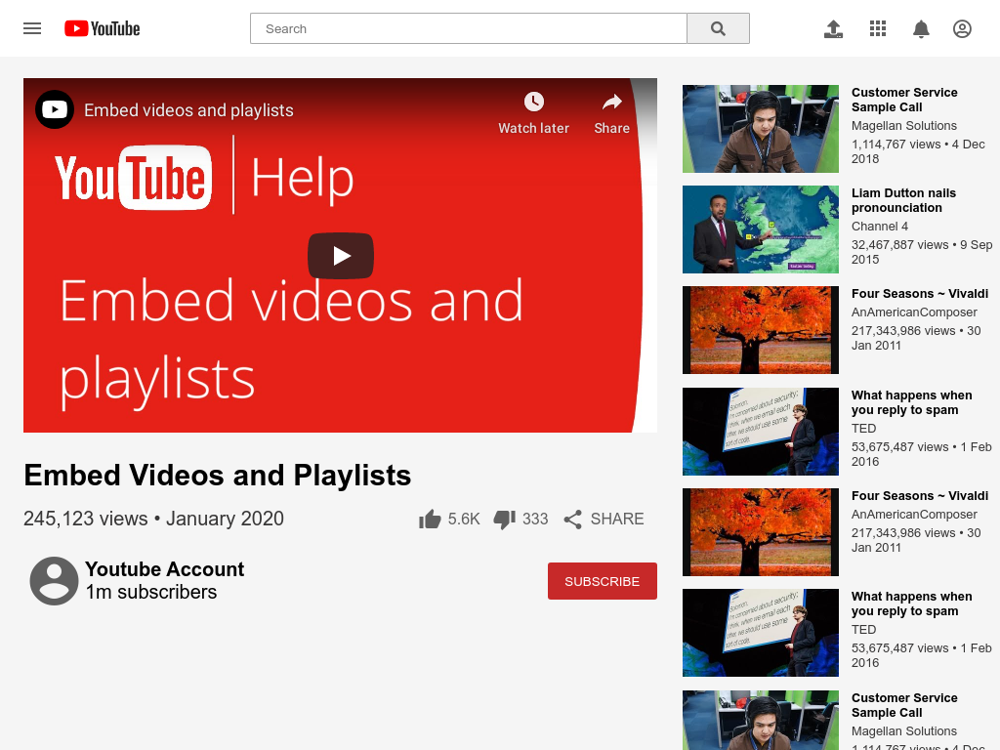

# Custom Video Player - Youtube Replica (basic-videoplayer)

A project to embed a youtube video onto an HTML page and replicate elements of the Youtube website

It includes a embedded youtube video as well as a search bar. It also a sidebar that tries to replicate the look of the youtube sidebar.

Implemented

## Built With

- HTML5,
- CSS3,
- Icons from Font-Awesome, Google Material UI

## Live Demo

[Live Demo Link](https://newhorizon-tech.github.io/basic-videoplayer/)

## Authors

👤 **Jorge Torres**

- Github: [@Yors-git](https://github.com/Yors-git)
- Twitter: [@Yors_82](https://twitter.com/Yors_82)

👤 **Alaukik**

- Github: [@newhorizon-tech](https://github.com/newhorizon-tech)
- Twitter: [@techintosh3](https://twitter.com/techintosh3)

## 🤝 Contributing

Contributions, issues and feature requests are welcome!

Feel free to check the [issues page](issues/).

## Show your support

Give a ⭐️ if you like this project!
